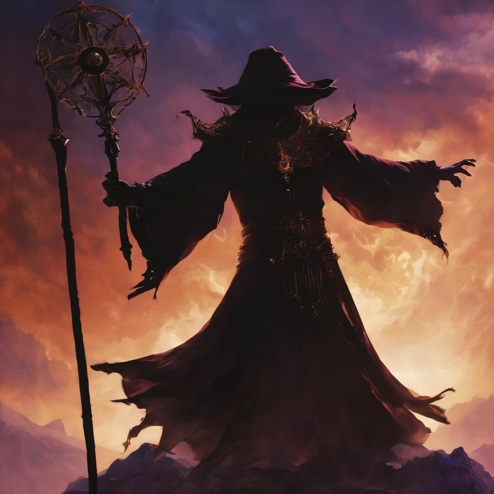

# Demigod Revelar

<figure><figcaption></figcaption></figure>

Revelar, a shadow-weaving demigod, embodies the twisted essence of darkness. Once a mortal with insatiable ambition, he transcended to demigodhood through his mastery of shadow magic. Consumed by a desire to control the Codex of Draconic Ascendancy, he weaves schemes from the shadows, orchestrating the Nexus—a realm between life and death—to identify a soul worthy of wielding the forbidden grimoire. His form is a silhouette of sinister elegance, draped in shadows, and his eyes flicker with the elusive knowledge he seeks. Revelar is the puppeteer of fate, seeking to ensnare a puppet capable of dancing to the tune of the Codex.
