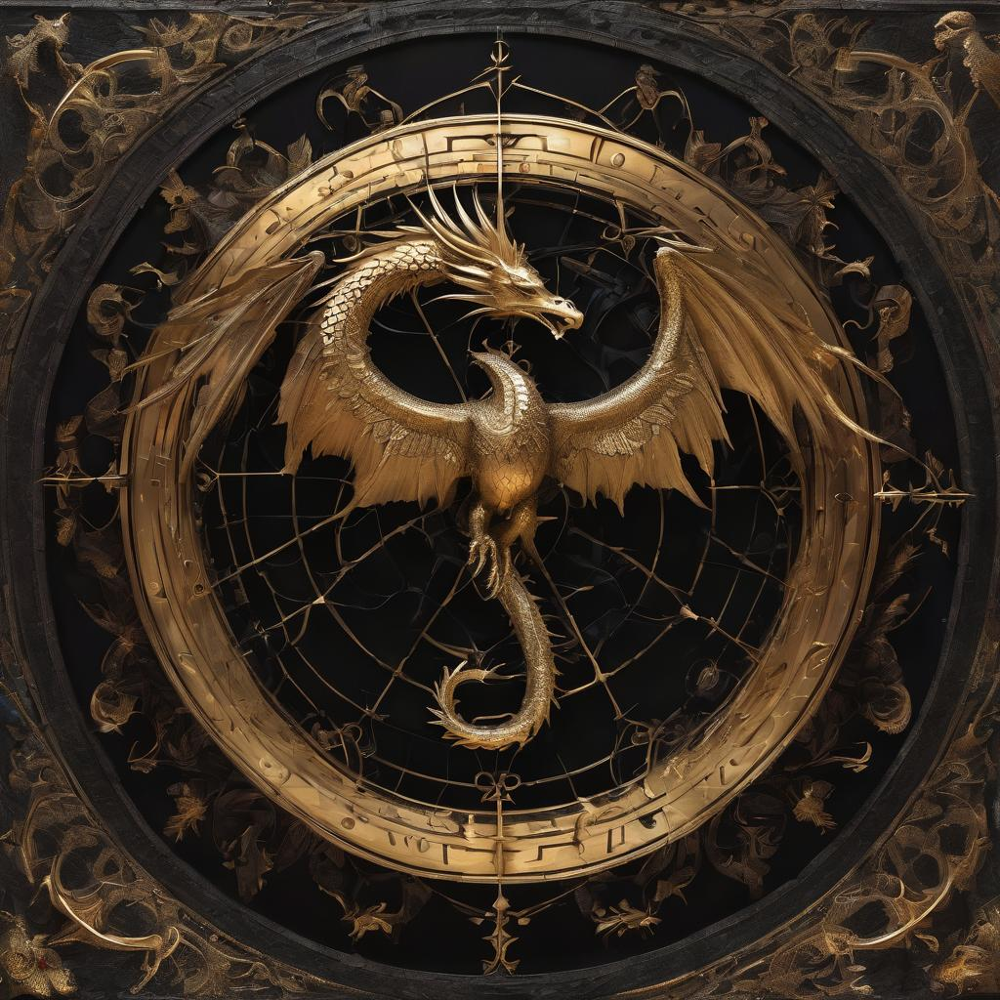

# The Eclipsian Brotherhood

<figure><figcaption>
The emblem of the brotherhood
</figcaption></figure>

Philosophy: The Eclipsian Brotherhood is a secretive and enigmatic faction that worships the ancient King, a mythical being believed to have the power to reshape the world. They are dedicated to awakening the King and ushering in a new era under his rule, with Shadowweaving as their primary source of magic.

Origins: The Brotherhood's roots trace back to a splinter group of mages and scholars who delved into forbidden magic. Over the centuries, they have grown in numbers and power, their ranks swelling with those drawn to the allure of darkness.

Headquarters: The Brotherhood operates from hidden fortresses known as "Eclipsian Bastions," shrouded in perpetual darkness. These fortresses serve as both training grounds and centers for dark rituals.

Magic: Members of the Brotherhood are adept Shadowweavers, harnessing the power of shadows and darkness. They use this magic for various purposes, from concealment and manipulation to offensive spells.

Relations: The Brotherhood is mistrusted and feared by both the Sages. Their ambitions to awaken the Dragon King threaten the balance of power in the world, leading to conflicts and covert operations against their rivals.
