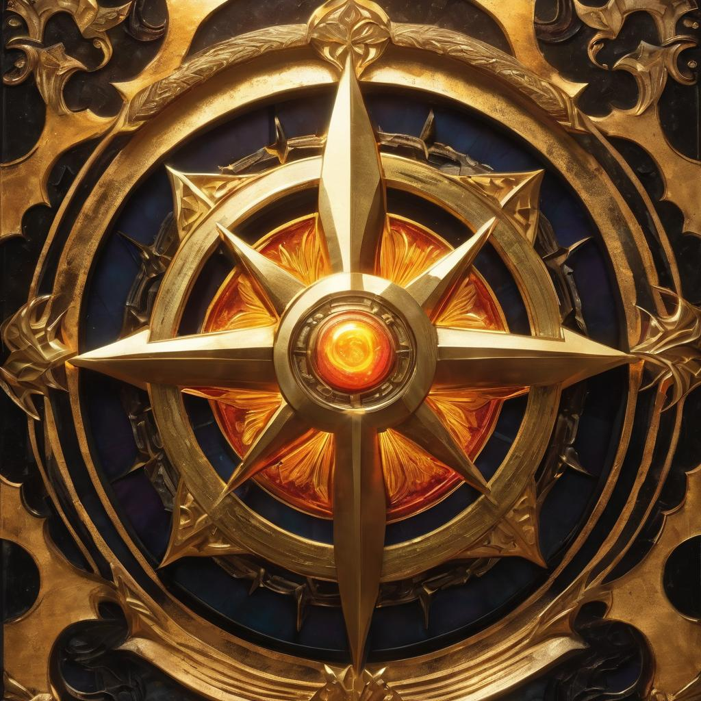

# The Phenixian Sages

<figure><figcaption>
The emblem of the sages
</figcaption></figure>

Philosophy: The Phenixian Sages is a noble and chivalrous organization dedicated to the principles of Aurawelding, a revered discipline of light and purity. They believe in maintaining harmony within the world, using their magic to protect and guide the people.

History: The Phenixian Sages trace their origins to ancient scholars and mystics who sought to bring light and healing to a world of darkness. Their teachings have been passed down through generations, shaping them into formidable defenders of the realm.

Headquarters: The Phenixian Sages' headquarters, known as the "Radiant Citadel," stands as a beacon of light atop a pristine mountain. It is a place of learning where Aurawelders train and study.

Magic: Aurawelders of the Sages wield the power of light and radiance. They use their magic for healing, protection, and purification, as well as offensive spells when necessary.

Relations: The Sages view the Brotherhood as a dangerous threat to the world's balance, leading to clashes between the two factions. They maintain an uneasy alliance with the Vanguard, as they share a common goal of protecting dragons.
