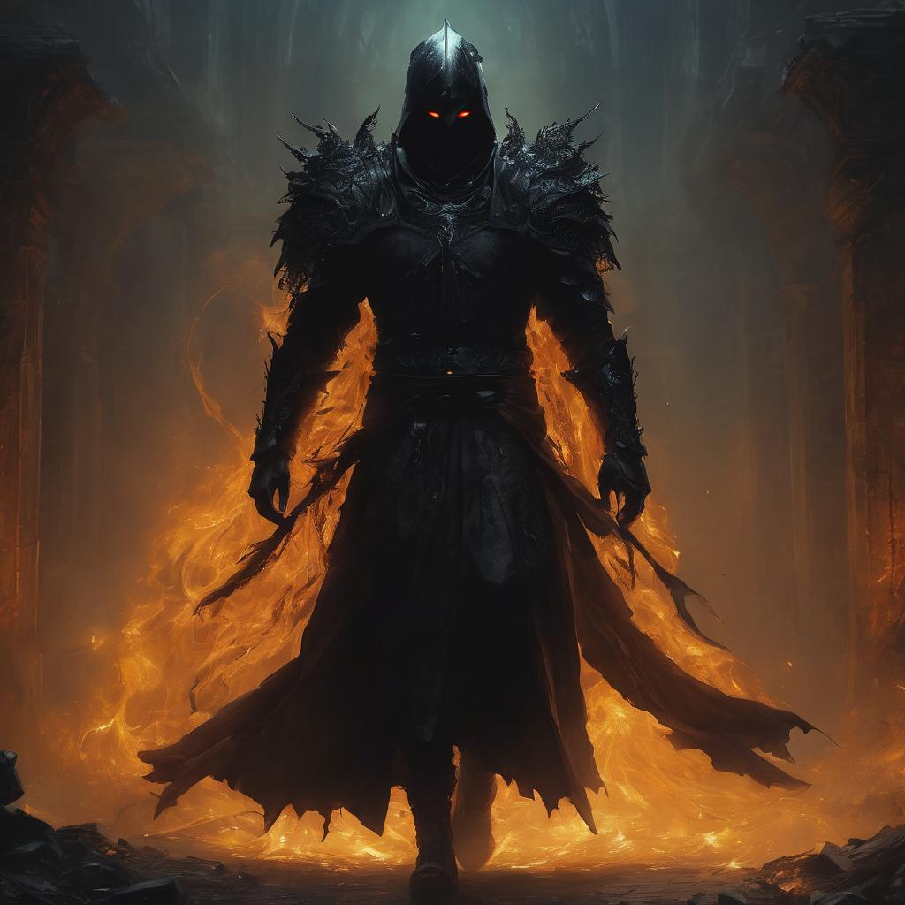

# Malgorth, the Shadow Weaver Lord

<figure><figcaption></figcaption></figure>

Malgorth's form remains obscured within an ever-shifting cloak of shadows, rendering precise details elusive. What glimpses reveal a silhouette draped in an ethereal shroud, with piercing, luminous eyes betraying an insatiable hunger for power. Dark tendrils of shadow emanate from his presence, hinting at the intertwining of his essence with the very fabric of darkness.

Malgorth exudes an aura of palpable malevolence, his every movement resonating with a sinister grace. The air around him seems to thicken with an oppressive darkness, and his presence alone is often enough to sow seeds of fear and doubt. His words, laced with the potency of shadow weaving, carry an otherworldly weight that unsettles even the most steadfast hearts.

As a Shadow Weaver Lord, Malgorth has mastered the arcane art that surpasses mortal comprehension. His Umbral Grasp can extend vast distances, ensnaring both the physical and metaphysical. Nightshade Veil renders him elusive, a phantom that eludes pursuers in the veiled embrace of shadows. Abyssal Bolts, cast with malevolent intent, pierce through adversaries' defenses, leaving a corrosive affliction in their wake.

Malgorth's ultimate ambition lies in consuming the heart of Ignatius, the ancient dragon. His twisted desire is to merge the essence of shadow weaving with the pure draconic lifeforce, ascending to unparalleled power. In his pursuit of eternal dominion, Malgorth orchestrates a grand tapestry of deception, manipulation, and subterfuge, leaving a trail of shadowy machinations that threaten the delicate balance between light and darkness.

As a central antagonist, Malgorth's presence casts a looming shadow over the fate of Echovale. Players must navigate the intricate web of his schemes, confront the darkness he unleashes, and thwart his relentless pursuit of draconic supremacy. The enigmatic figure of Malgorth stands as a testament to the perils that await those who delve too greedily into the arcane mysteries woven within the world of Beware of Dragons.
