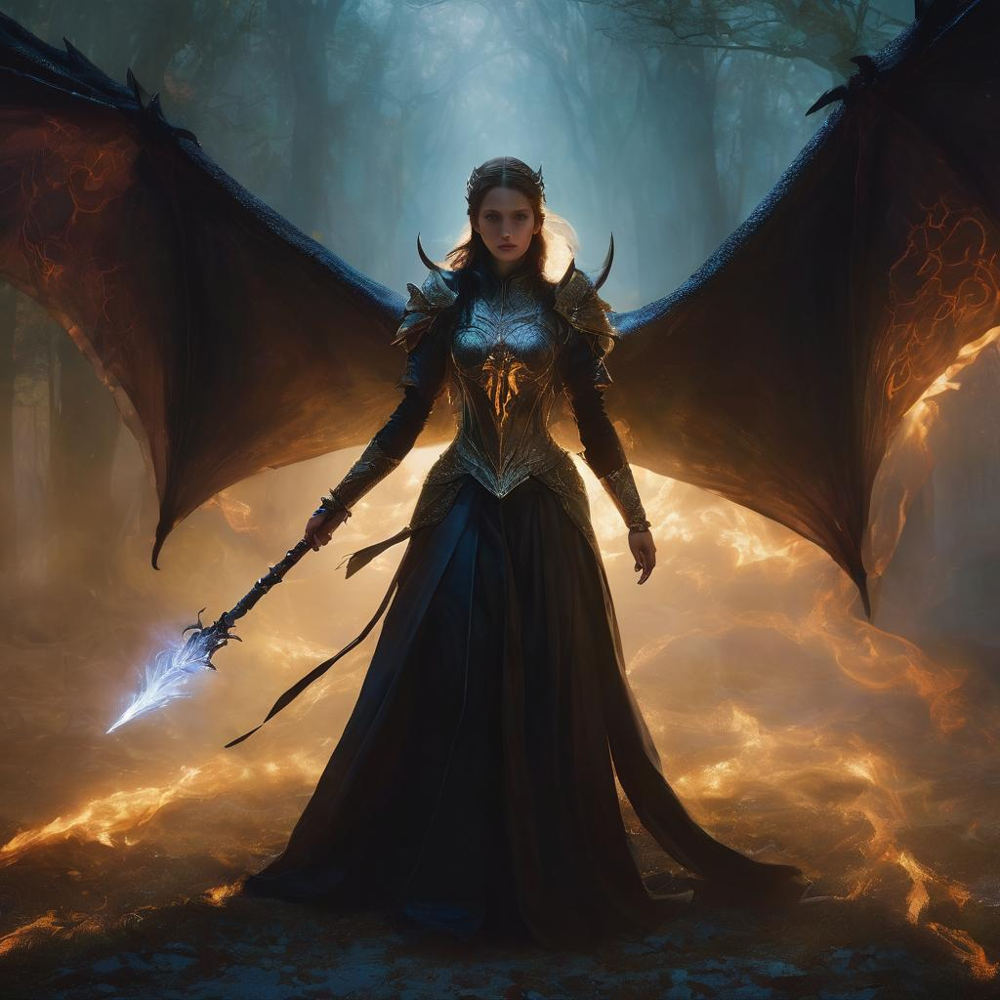

# Seraphina, High Draconic Priestess

<figure><figcaption></figcaption></figure>

Her form, obscured in an ever-shifting cloak of draconic shadows, reveals a silhouette draped in mystical elegance. Luminous eyes betray an insatiable hunger for power, a desire born from her twisted devotion to draconic secrets. Dark tendrils of shadow intertwine with her being, emblematic of the forbidden knowledge she sought in the depths of Echovale.

An oppressive darkness thickens in the air around her, and an aura of palpable malevolence accompanies each of her calculated movements. Seraphina's staff, an artifact forged from five shards of the Codex, symbolizes her mastery over ancient draconic mysteries, granting her dominion over the shadows themselves.

Her ultimate ambition, concealed in the whispers of Henion's ancient corridors, is to resurrect Ignatius, the ancient dragon. Through this unholy alliance, she seeks to meld draconic lifeforce with the forbidden enchantments she's mastered, ascending to unparalleled power. Seraphina orchestrates a grand tapestry of deception, manipulation, and subterfuge, leaving a trail of shadowy machinations threatening the delicate balance between light and darkness.

As a central antagonist, her enigmatic figure is a testament to the perils that await those who delve too deeply into the arcane mysteries woven within the world of "Beware of Dragons." Players must navigate the intricate web of her draconic schemes, confronting the shadows she unleashes and thwarting her relentless pursuit of draconic supremacy in this dark fantasy realm.
